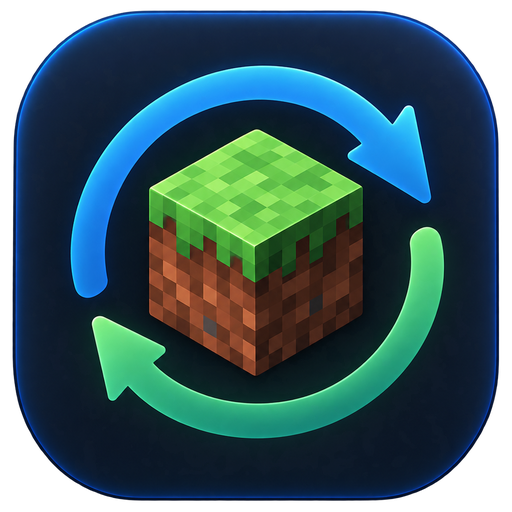

<p align="center">
  
</p>

<h1 align="center">MineSync</h1>

<p align="center">
  Keep your Minecraft worlds in sync across all your computers, through your own Google Drive.<br>
  Windows · macOS · Linux
</p>

---

## Table of contents

1. [What is MineSync?](#what-is-minesync)
2. [Features](#features)
3. [How it works](#how-it-works)
4. [Before you start](#before-you-start)
5. [Download and install](#download-and-install)
   - [Windows](#windows)
   - [macOS](#macos)
   - [Linux](#linux)
6. [Google Cloud setup (one time)](#google-cloud-setup-one-time)
7. [First use](#first-use)
8. [Everyday use](#everyday-use)
9. [Conflicts, backups and safety](#conflicts-backups-and-safety)
10. [Where MineSync stores its data](#where-minesync-stores-its-data)
11. [Uninstall](#uninstall)
12. [Build from source](#build-from-source)
13. [Troubleshooting](#troubleshooting)
14. [Known limitations](#known-limitations)
15. [Project structure](#project-structure)
16. [License and disclaimer](#license-and-disclaimer)

---

## What is MineSync?

MineSync is a desktop application that synchronizes **Minecraft Java Edition worlds** between several computers using **Google Drive** as shared storage.

The idea is simple:

1. You play on **PC A**, then quit the world.
2. MineSync detects that the world is closed and uploads the changes to your Google Drive.
3. On **PC B**, MineSync downloads the new version.
4. You launch Minecraft on PC B and continue exactly where you left off.

Each synchronized world is called a **session**. A session links one world folder on your computer (for example `.minecraft/saves/MyWorld`) to one folder in your Google Drive (for example `Minecraft Sync/MyWorld`).

MineSync works with vanilla and **modded** worlds, and with the most common launchers.

---

## Features

- **Automatic world detection** for the official launcher, Prism Launcher, CurseForge and Modrinth App, plus any custom folder (MultiMC portable, ATLauncher, etc.).
- **Version and mod detection**: reads the Minecraft version and the vanilla/modded flag from `level.dat`. Both can be edited by hand.
- **One card per world** showing:
   - its current state;
   - the last synchronization time and the computer it came from;
   - an auto-sync switch, a "Sync now" button, settings, and quick access to the world folder.
- **Automatic sync after playing**: the upload starts a few seconds after you close the world (10 s by default).
- **Automatic download** of changes made on another computer (checked every 2 minutes by default).
- **Differential, recursive sync**: only modified files are transferred. The whole world folder is covered, with no fixed file list, so modded data folders are included.
- **Conflict detection**: if a world was changed on two computers, MineSync never overwrites anything silently. You choose which version to keep.
- **Automatic backups** of your local world before it is replaced.
- **Network-safe**: an interrupted transfer never leaves a half-updated world, locally or on Drive.
- **Light and dark themes**, or follow your system setting.
- **Privacy-friendly**: MineSync can only see the files it created in your Drive, never the rest of it.

---

## How it works

### Detecting when you play

When Minecraft opens a world, it locks the world's `session.lock` file. Every 5 seconds, MineSync checks this lock:

| Situation | What MineSync does |
|---|---|
| World open in Minecraft | Waits. Nothing is synchronized while you play. |
| World just closed (even if the game is still running) | Waits for the quiet delay (10 s), then synchronizes. |
| World not in use | Checks Google Drive regularly for newer versions. |

This works with every launcher. It also detects when you return to the main menu, not only when you quit the game.

### What is stored on Google Drive

```
Minecraft Sync/                 ← root folder, created by MineSync
└── MyWorld/                    ← one folder per session
    ├── manifest.json           ← list of files (path, size, SHA-256), revision, device, date
    ├── lock.json               ← present while a computer is playing this world
    └── files/                  ← file contents, named after their path in the world
```

The `files/` folder is not meant to be browsed by hand. Always use MineSync to restore a world.

### Deciding what to do

At each sync, MineSync compares three states: your **local world**, the **Drive version**, and the **last synchronized state** it remembers.

| Local world | Drive version | Action |
|---|---|---|
| unchanged | unchanged | nothing |
| changed | unchanged | upload the modified files |
| unchanged | changed | download the modified files |
| changed | changed differently | **conflict**: you decide |

---

## Before you start

| You need | Details |
|---|---|
| Minecraft **Java Edition** | Bedrock Edition is not supported. |
| A **Google account** | The same account on every computer. |
| A **Google Cloud OAuth client** (`credentials.json`) | Free, created once in about 10 minutes. See [Google Cloud setup](#google-cloud-setup-one-time). |
| A 64-bit computer | Windows 10/11, macOS (Apple Silicon or Intel), or a desktop Linux distribution. |

The installers include their own Java runtime: **you do not need to install Java** to use MineSync.

> **Important:** use the **same Google account**, the **same `credentials.json`** and the **same root folder name** on all your computers. Otherwise, the computers will not see each other's worlds.

---

## Download and install

Download the file for your system from the **Releases** page of this repository.

| System | File |
|---|---|
| Windows | `MineSync-<version>.exe` |
| macOS | `MineSync-<version>.dmg` (Apple Silicon and Intel builds are separate) |
| Linux | `MineSync-<version>-linux-x64.tar.gz` |

If a `.sha256` file is provided, you can check the download before installing:

```bash
# Linux
sha256sum -c MineSync-<version>-linux-x64.tar.gz.sha256
# macOS
shasum -a 256 MineSync-<version>.dmg        # compare with the .sha256 file
```
```powershell
# Windows (PowerShell)
Get-FileHash .\MineSync-<version>.exe -Algorithm SHA256
```

### Windows

1. Double-click `MineSync-<version>.exe`.
2. **SmartScreen warning.** If Windows shows "Windows protected your PC", click **More info › Run anyway**. MineSync is not code-signed yet, so this warning is expected.
3. Follow the installer:
   - no administrator rights are needed (MineSync installs for your user only);
   - you can choose the installation folder.
4. Launch **MineSync** from the Start menu (MineSync group) or from the desktop shortcut.

Updating: run the installer of the new version. It replaces the previous one and keeps your settings and sessions.

### macOS

1. Download the build matching your Mac:
   - **Apple Silicon** (M1, M2, M3…): the `arm64` / `aarch64` build;
   - **Intel**: the `x64` build.

   To check: Apple menu › **About This Mac**.
2. Open the `.dmg` and drag **MineSync** into **Applications**.
3. **First launch.** MineSync is not notarized by Apple yet, so macOS blocks it the first time:
   - double-click MineSync, then close the warning;
   - open **System Settings › Privacy & Security**, scroll down, and click **Open Anyway** next to the MineSync message;
   - confirm. You only need to do this once.

   On older macOS versions, right-click the app › **Open** › **Open** also works.

   Advanced alternative (Terminal):
   ```bash
   xattr -dr com.apple.quarantine /Applications/MineSync.app
   ```

### Linux

The Linux build is a self-contained folder: it works on most 64-bit desktop distributions (Arch, Debian, Ubuntu, Fedora, Mint…). A graphical desktop with GTK 3 is required, as on any standard desktop.

**1. Extract**
```bash
mkdir -p ~/.local/share/minesync
tar -xzf MineSync-<version>-linux-x64.tar.gz -C ~/.local/share/minesync
```

**2. Try it**
```bash
~/.local/share/minesync/MineSync/bin/MineSync
```

**3. Add it to your applications menu, with its icon**
```bash
install -Dm644 ~/.local/share/minesync/MineSync/lib/MineSync.png \
  ~/.local/share/icons/hicolor/512x512/apps/minesync.png

mkdir -p ~/.local/share/applications
cat > ~/.local/share/applications/minesync.desktop <<EOF
[Desktop Entry]
Type=Application
Name=MineSync
Comment=Sync your Minecraft worlds through Google Drive
Exec=$HOME/.local/share/minesync/MineSync/bin/MineSync
Icon=minesync
Terminal=false
Categories=Game;Utility;
EOF
```

MineSync now appears in your applications menu. If it does not show up right away, log out and back in.

**Optional: launch it from a terminal with `minesync`**
```bash
mkdir -p ~/.local/bin
ln -sf ~/.local/share/minesync/MineSync/bin/MineSync ~/.local/bin/minesync
```

> Keep the whole `MineSync` folder together: it contains its own Java runtime in `lib/runtime`. Moving only the `bin` folder breaks the application.

Updating: delete `~/.local/share/minesync/MineSync`, then repeat step 1. Your sessions and settings are stored elsewhere and are kept.

---

## Google Cloud setup (one time)

MineSync uses **your own** access to the Google Drive API. You create it once, then copy the same `credentials.json` to every computer.

1. Go to <https://console.cloud.google.com> and create a project (for example "MineSync").
2. **Enable the API**: *APIs & Services › Library* › search for **Google Drive API** › **Enable**.
3. **Consent screen**: *Google Auth Platform › Branding* (or *Overview*) › **Get started**.
   - App name: MineSync. Support email: yours.
   - Audience: **External**.
   - Contact information: your email. Accept the policy, then **Create**.
4. **Data access** (optional): add the scope `.../auth/drive.file`. It is the only scope MineSync requests: it gives access **only to the files MineSync creates**, never to the rest of your Drive.
5. **Publish the app** (important): *Audience* › **Publish app**.
   - In "Testing" mode, Google expires your authorization **every 7 days** and you would have to reconnect weekly.
   - `drive.file` is not a sensitive scope, so publishing does not require Google verification.
   - When you connect, Google will show an "unverified app" screen: click **Advanced › Go to MineSync**.
   - If you prefer to stay in Testing mode, add your email under *Audience › Test users*.
6. **Create the OAuth client**: *Google Auth Platform › Clients › Create client* › Application type **Desktop app** › **Create** › **Download JSON**.
7. Rename the downloaded file to `credentials.json` and keep it somewhere safe. Do not share it publicly.

---

## First use

### On the computer that already has the world (PC A)

1. Launch MineSync and click **Connect Google Drive**.
2. When asked, select your `credentials.json`.
3. Keep the suggested root folder name (`Minecraft Sync`) or choose another one. **Use the same name on every computer.**
4. Your browser opens: sign in and allow access. If it does not open, copy the address shown in MineSync into your browser.
5. Click **+ Add a session**, select the world, check its name, version and type, then click **Create session**.
6. The first upload sends the whole world. Large modded worlds can take a few minutes.

### On another computer (PC B)

1. Install MineSync and connect Google Drive with the **same account, the same `credentials.json` and the same root folder name**.
2. A notice tells you that sessions are available. Click **☁ Sessions available on Google Drive**.
3. Choose the session, then the destination `saves` folder. Pick the launcher and instance where you will play this world, with the **same Minecraft version and the same mods** as on PC A.
4. Click **Add to this PC**. The world is downloaded, verified file by file, then installed.

> The interface is currently in French. Button names above are translated; look for the equivalent French labels in the app.

---

## Everyday use

**Keep MineSync running while you play** (minimized is fine). It is MineSync that detects the end of your play session. If it was closed, pending changes are synchronized at the next launch.

A typical cycle:

1. Start MineSync, then Minecraft.
2. Play. The session card shows **World in use**.
3. Close the world. After about 10 seconds the card shows **Syncing**, then **Sync active**.
4. On the other computer, MineSync picks up the new version within 2 minutes. Click **Sync now** to do it immediately.
5. Wait until the card shows **Sync active** before launching Minecraft there.

### Session states

| Color | State | Meaning |
|---|---|---|
| 🟢 Green | Sync active | Up to date. |
| 🔵 Blue | Syncing / Minecraft closed, sync imminent | Transfer in progress or about to start. |
| 🟠 Orange | World in use / In use on another device | Waiting: the world is open here or on another computer. |
| 🔴 Red | Conflict detected / Sync failed | Your attention is needed (see the message on the card). |
| ⚪ Grey | Sync disabled / Google Drive not connected | Nothing happens until you enable it or connect. |

### Settings (⚙ button)

| Setting | Default | Purpose |
|---|---|---|
| Computer name | host name | Shown on other computers ("last sync from…"). |
| Google Drive root folder | `Minecraft Sync` | Must be identical on every computer. |
| Delay after closing the world | 10 s | Quiet time before uploading. |
| Check for changes every | 2 min | How often Drive is checked for newer versions. |
| Backups kept per session | 3 | Local backups made before a world is replaced. |
| Extra world locations | none | Custom `saves`, `.minecraft` or instances folders. |

The theme (System / Light / Dark) is chosen from the menu at the top of the window.

---

## Conflicts, backups and safety

### What is a conflict?

A conflict happens when the same world was changed on **two computers** before they could synchronize. For example, you played offline on both, or played on PC B before PC A had finished uploading.

MineSync then shows **Conflict detected** and a **Resolve conflict** button. The dialog compares both versions (date, number of files, size, origin computer) and offers three choices:

| Choice | What happens |
|---|---|
| **Use the local version** | This computer's world is uploaded. The previous Drive version goes to the **Google Drive trash** (recoverable for 30 days). |
| **Use the Google Drive version** | A **full backup** of your local world is made first, then the world is replaced. |
| **Cancel** | Nothing changes. You can decide later. |

Make sure Minecraft is closed on **both** computers before choosing.

### Safety rules built into MineSync

- **Never during play**: a world open in Minecraft is never synchronized.
- **Uploads are atomic**: new files are uploaded first, and the Drive version is only updated once everything succeeded. A network cut leaves the previous version intact.
- **Downloads are verified**: every file is checked with SHA-256 before your world is touched. If something fails while replacing files, the original files are put back.
- **No accidental deletion**: if your world folder disappears (deleted, external drive unplugged), MineSync refuses to delete anything on Drive.
- **Corrupted data is never overwritten**: an unreadable Drive manifest stops the sync instead of replacing it.
- **Removing a session never deletes a world**, neither on your computer nor on Drive.

### Restoring a world

- **From Google Drive**: session card › *More* › *Settings* › **Restore from Google Drive**. Your local world is backed up first.
- **From a local backup**: *Settings* › **Open backups**. Each backup is a complete copy of the world folder; copy it back into your `saves` folder with Minecraft closed.

---

## Where MineSync stores its data

| System | Folder |
|---|---|
| Windows | `%APPDATA%\MinecraftSync` |
| macOS | `~/Library/Application Support/MinecraftSync` |
| Linux | `~/.local/share/minecraft-sync` (or `$XDG_DATA_HOME/minecraft-sync`) |

Contents:

| Item | Description |
|---|---|
| `minecraft-sync.db` | Sessions, settings and last synchronized state (SQLite). |
| `credentials.json` | Your Google OAuth client. |
| `tokens/` | Your Google authorization. Deleted when you click **Disconnect**. |
| `backups/` | Local backups of your worlds. |

Your Minecraft worlds themselves stay in your launcher's `saves` folders.

---

## Uninstall

Uninstalling MineSync **never deletes your worlds**, neither locally nor on Google Drive.

| System | How |
|---|---|
| Windows | *Settings › Apps › Installed apps* › MineSync › **Uninstall**. |
| macOS | Drag `MineSync.app` from *Applications* to the Trash. |
| Linux | Delete `~/.local/share/minesync`, `~/.local/share/applications/minesync.desktop` and `~/.local/share/icons/hicolor/512x512/apps/minesync.png` (and `~/.local/bin/minesync` if you created it). |

To also remove MineSync's own data (sessions, settings, backups), delete the data folder listed in [the previous section](#where-minesync-stores-its-data). To remove your worlds from Drive, delete the `Minecraft Sync` folder in Google Drive.

---

## Build from source

### Requirements

| Tool | Version |
|---|---|
| JDK | **25** or later (e.g. Eclipse Temurin 25) |
| Maven | 3.9 or later |
| Git | any recent version |

JavaFX and all other libraries are downloaded by Maven.

### Common commands

```bash
git clone <repository-url> MineSync
cd MineSync

mvn test                          # automated tests
mvn javafx:run                    # run the app directly
mvn package                       # self-contained JAR: target/minecraft-sync-1.0.0-all.jar
mvn clean verify -Pjpackage       # native package for the current OS
```

The native package is written to `target/jpackage/output/`.

**Each package must be built on its own system**: jpackage cannot build a Windows `.exe` on Linux, nor a macOS `.dmg` on Windows. The self-contained JAR also only contains the JavaFX native libraries of the system that built it.

| Build system | Default output | Icon used |
|---|---|---|
| Linux | `MineSync/` app image | `packaging/icons/linux/minesync.png` |
| Windows | `MineSync-<version>.exe` installer | `packaging/icons/windows/minesync.ico` |
| macOS | `MineSync-<version>.dmg` | `packaging/icons/macos/minesync.icns` |

To build another type, add `-Djpackage.type=…` (`app-image`, `deb`, `rpm`, `msi`, `pkg`). The package version is set by `jpackage.app.version` in `pom.xml` and must be purely numeric (e.g. `1.0.0`).

### Linux (example: Arch Linux)

```bash
sudo pacman -S --needed jdk-openjdk maven git
java -version                     # must be 25 or later (switch with: sudo archlinux-java set <version>)

mvn clean verify -Pjpackage
target/jpackage/output/MineSync/bin/MineSync        # quick test

./packaging/linux/install-local.sh                   # install in your applications menu
./packaging/linux/install-local.sh --remove          # uninstall (data and worlds are kept)

# Archive for distribution
tar -C target/jpackage/output -czf MineSync-1.0.0-linux-x64.tar.gz MineSync
sha256sum MineSync-1.0.0-linux-x64.tar.gz > MineSync-1.0.0-linux-x64.tar.gz.sha256
```

Optional `.deb` / `.rpm` packages (for Debian/Ubuntu or Fedora users):
```bash
sudo pacman -S --needed dpkg fakeroot        # for .deb
sudo pacman -S --needed rpm-tools            # for .rpm
mvn clean verify -Pjpackage -Djpackage.type=deb \
    -Djpackage.extra.args=@packaging/jpackage/linux-installer.args
```
Replace the placeholder maintainer address in `packaging/jpackage/linux-installer.args` before publishing.

> `target/` is wiped by every `mvn clean`: never point a shortcut to it. Use `install-local.sh`, which copies the app to `~/.local/share/minesync/app`.

### Windows

1. Install Git, **JDK 25** (check "Set JAVA_HOME" in the installer) and **Maven 3.9** (add its `bin` folder to `PATH`).
2. Install **WiX Toolset**, required by jpackage for `.exe` and `.msi`:
   - simplest: WiX **3.14**, with its `bin` folder added to `PATH`;
   - WiX 4 and 5 are also supported by jpackage since JDK 24.
3. Open a **new** PowerShell window and check:
   ```powershell
   java -version
   mvn -v
   candle -?          # WiX 3 (or: wix --version for WiX 4/5)
   ```
4. Build:
   ```powershell
   git clone <repository-url> C:\dev\MineSync
   cd C:\dev\MineSync
   mvn clean verify -Pjpackage
   ```
5. Result: `target\jpackage\output\MineSync-1.0.0.exe`.

Tips:
- Use a short path without special characters (e.g. `C:\dev\MineSync`): WiX handles long paths poorly.
- If jpackage complains about WiX, it is almost always the `PATH`. Reopen PowerShell after changing it.
- **Never change** `--win-upgrade-uuid` in `packaging/jpackage/windows.args`: it allows new versions to replace older ones.
- On a managed work computer, security policies may block these tools or unsigned installers.

### macOS

1. Install a **JDK 25 matching the target architecture** (aarch64 for Apple Silicon, x64 for Intel) and Maven, for example with Homebrew:
   ```bash
   brew install --cask temurin@25
   brew install maven
   ```
2. Build:
   ```bash
   mvn clean verify -Pjpackage                             # → target/jpackage/output/MineSync-1.0.0.dmg
   mvn clean verify -Pjpackage -Djpackage.type=app-image   # → target/jpackage/output/MineSync.app only
   ```
3. Build once per architecture: a package built on Apple Silicon does not run on Intel Macs, and vice versa.

Code signing and notarization (Apple Developer account) can be added later in `packaging/jpackage/macos.args` (`--mac-sign`, `--mac-signing-key-user-name`).

### Icons

All icons are generated from a single source image:

| File | Used for |
|---|---|
| `packaging/icons/minesync-source.png` | Original logo (the only file to edit). |
| `packaging/icons/linux/minesync.png` | Linux launcher and menu entry (512 px). |
| `packaging/icons/windows/minesync.ico` | Windows installer, Start menu, shortcut (16–256 px). |
| `packaging/icons/macos/minesync.icns` | `MineSync.app` and `.dmg` (16–1024 px, Retina). |
| `src/main/resources/com/minecraftsync/ui/logo.png` | In-app header logo and window/taskbar icon. |

To change the logo, replace the source image (square PNG, transparent background, 1024 px recommended), then run:
```bash
python3 packaging/icons/generate-icons.py      # requires Pillow (Arch: python-pillow, elsewhere: pip install pillow)
```

### Testing two computers on one machine

The `minecraftsync.home` property gives each instance its own data folder, so two instances behave like two different computers:

```bash
java -Dminecraftsync.home=/tmp/pcA -jar target/minecraft-sync-1.0.0-all.jar
java -Dminecraftsync.home=/tmp/pcB -jar target/minecraft-sync-1.0.0-all.jar
```

With a packaged build, use the `JAVA_TOOL_OPTIONS` environment variable:
```bash
JAVA_TOOL_OPTIONS="-Dminecraftsync.home=/tmp/test-minesync" ./MineSync/bin/MineSync
```

In instance B, import the session into a **different** `saves` folder and give it another computer name in ⚙ Settings.

### Automated tests

`mvn test` runs 15 tests. They replace Google Drive with a simulated storage and simulate two computers. They cover:

- the first upload and the import on a second computer;
- differential uploads;
- round trips with added and deleted files;
- conflict detection and both resolutions (including backup verification);
- worlds in use;
- network failures during upload;
- deleted worlds, presence locks and corrupted manifests;
- `level.dat` parsing;
- the full "open, play, close, upload" cycle.

---

## Troubleshooting

| Problem | Solution |
|---|---|
| **The other computer does not see my world** | Check that both use the same Google account, the same `credentials.json` and the same root folder name (⚙ Settings). |
| **I have to reconnect to Google every week** | Your Google Cloud app is still in "Testing" mode: publish it (step 5 of the Google Cloud setup). |
| **The browser does not open when connecting** | Copy the address shown in the yellow notice into your browser. |
| **The card stays on "World in use"** | Minecraft still has the world open. Return to the main menu or quit the game. |
| **"Sync failed"** | Read the message on the card. MineSync retries automatically every 5 minutes; you can also click **Sync now**. Your world is never left half-updated. |
| **"World folder not found"** | The world was moved, renamed or is on an unplugged drive. Nothing was deleted on Drive. Restore via *Settings › Restore from Google Drive*. |
| **A world is not listed in "Add a session"** | Click **Browse…** and select the world folder (or its `saves` folder), or add the location in ⚙ Settings. |
| **Linux: MineSync is not in the menu** | Log out and back in. Check that `~/.local/share/applications/minesync.desktop` exists. |
| **Linux: double-clicking the executable does nothing** | Some file managers do not run binaries on double-click. Use the menu entry or launch it from a terminal. |
| **macOS: "MineSync cannot be opened"** | See the [first launch steps](#macos) (Privacy & Security › Open Anyway). |
| **Windows: "Windows protected your PC"** | Click **More info › Run anyway**. |
| **The app does not start** | Launch it from a terminal (`MineSync/bin/MineSync` on Linux, `/Applications/MineSync.app/Contents/MacOS/MineSync` on macOS) and read the error messages. |

---

## Known limitations

- **MineSync must be running** for automatic sync. There is no background service and no system tray icon yet.
- **The same `credentials.json` is required on every computer.** This comes from the `drive.file` scope, chosen so MineSync never accesses the rest of your Drive. For the same reason, a folder created by hand in Drive is invisible to MineSync: the root folder must be created by MineSync.
- **Each user needs their own Google Cloud project** for now. This is fine for personal use but not for a wide public release.
- **Minecraft version and mods are not checked** between computers. Opening a modded world with different mods is your responsibility.
- **No merging, no full history**: only local backups (3 by default) and the Google Drive trash (30 days).
- **Very large files** (several GB) are re-sent entirely if the upload is interrupted.
- **Symbolic links** inside a world are ignored.
- **The interface is in French only.**
- **The window title** still reads "Minecraft Sync".
- **Package size** is about 180 MB once installed, because the full Java runtime is bundled.
- **Packages are not code-signed**: Windows SmartScreen and macOS Gatekeeper show a warning on first launch.

---

## Project structure

```
MineSync/
├── pom.xml                      Maven build (Java 25, JavaFX, jpackage profiles)
├── packaging/
│   ├── icons/                   source logo, generated PNG / ICO / ICNS, generator script
│   ├── jpackage/                jpackage arguments per OS (common, linux, windows, macos)
│   ├── linux/                   desktop entry template and install-local.sh
│   └── README-packaging.md      detailed packaging notes (French)
└── src/
    ├── main/java/com/minecraftsync/
    │   ├── Main.java            entry point
    │   ├── ui/                  JavaFX interface (no sync logic)
    │   ├── sync/                sync engine, independent from the UI
    │   │   ├── CloudStorage     storage interface (ready for other providers)
    │   │   ├── SyncEngine       decisions, upload, download, rollback
    │   │   ├── FileComparator   recursive scan + SHA-256
    │   │   ├── ConflictManager  conflict details and backups
    │   │   └── SyncService      sessions, background execution, events
    │   ├── google/              OAuth 2.0 and Google Drive implementation
    │   ├── minecraft/           world lock detection, launcher detection, level.dat reader
    │   ├── database/            SQLite storage
    │   ├── model/               sessions, states, file entries
    │   └── util/                paths, hashing, JSON, formatting
    ├── main/resources/          stylesheet and logo
    └── test/java/               automated tests with simulated storage
```

To add another cloud provider (OneDrive, Dropbox…), implement `CloudStorage`: the sync engine does not need to change.

---

## License and disclaimer

License: *to be defined*.

MineSync is an independent project. It is **not an official Minecraft product** and is not approved by or associated with Mojang or Microsoft. Minecraft is a trademark of Mojang Synergies AB.